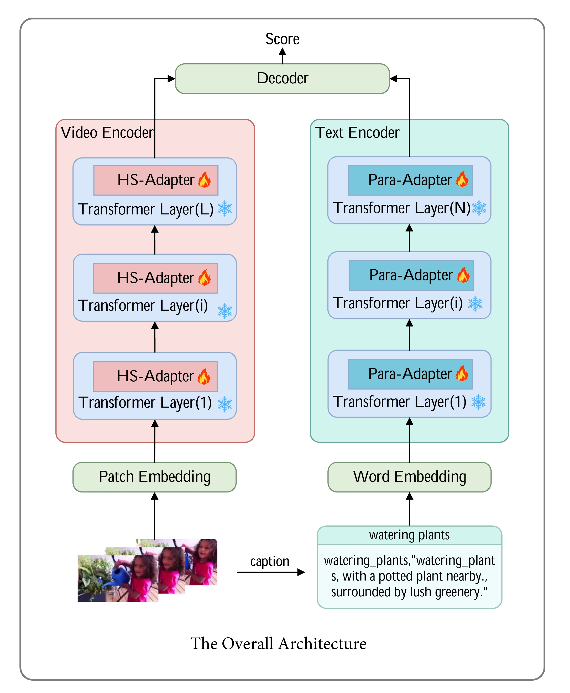

# MHoS-Adapter: Multimodal Higher-Order Statistical Adapter For Video Action Recognition

## Overview


This is the official PyTorch implementation of **MHoS-Adapter**, a novel parameter-efficient framework for adapting CLIP to video action recognition. Our method introduces higher-order statistical modeling to capture fine-grained discriminative features that are crucial for distinguishing visually similar actions.

## Content
- [Environment Setup](#environment-setup)
- [Data Preparation](#data-preparation)
- [Model Zoo](#model-zoo)
- [Testing](#testing)
- [Training](#training)
- [Citing MHoS-Adapter](#citing-mhos-adapter)
- [Acknowledgments](#acknowledgments)

## Environment Setup

```
conda create -n fusion python=3.10
conda activate fusion
pip install -r requirements.txt
```

## Data Preparation

For downloading the Kinetics datasets, you can refer to [mmaction2](https://github.com/open-mmlab/mmaction2/blob/master/tools/data/kinetics/README.md) or [CVDF](https://github.com/cvdfoundation/kinetics-dataset). For [UCF-101](https://www.crcv.ucf.edu/data/UCF101.php) and [HMDB-51](https://serre-lab.clps.brown.edu/resource/hmdb-a-large-human-motion-database/), you can easily get them from the official website.

Due to limited storage, we decord the videos in an online fashion using [decord](https://github.com/dmlc/decord).

We provide the following two ways to organize the dataset:

- **Option \#1:** Standard Folder. For standard folder, put all videos in the `videos` folder, and prepare the annotation files as `train.txt` and `val.txt`. Please make sure the folder looks like this:
    ```Shell
    $ ls /PATH/TO/videos | head -n 2
    a.mp4
    b.mp4

    $ head -n 2 /PATH/TO/train.txt
    a.mp4 0
    b.mp4 2

    $ head -n 2 /PATH/TO/val.txt
    c.mp4 1
    d.mp4 2
    ```


-  **Option \#2:** Zip/Tar File. When reading videos from massive small files, we recommend using zipped files to boost loading speed. The videos can be organized into a `tar` file `videos.tar`, which looks like:
    ```Shell
    $ tar -tvf /PATH/TO/videos.tar | head -n 2
    a.mp4
    b.mp4
    ```
    The `train.txt` and `val.txt` are prepared in the same way as option \#1.

Since that our method employs semantic information in text labels, rather than traditional one-hot label, it is necessary to provide a textual description for each video category. For example, we provide the text description of Kinetics-400 in the file `labels/kinetics_400_labels.csv`. Here is the format:
```Shell
$ head -n 5 labels/kinetics_400_labels.csv
id,name
0,abseiling
1,air drumming
2,answering questions
3,applauding
```
The `id` indicates the class id, while the `name` denotes the text description.

## Model Zoo

For evaluation, we provide the checkpoints of our models in the following tables.  
Our proposed **MHoS-Adapter** consistently improves CLIP-based backbones across different datasets and training settings with parameter-efficient fine-tuning.  

---

### Fully-supervised on Kinetics-400

| Model | Pre-training | Tunable Param (M) | Frames×Crops×Clips | Top-1 (%) | Top-5 (%) | GFLOPs |
|--|--|--|--|--|--|--|
| **Full Finetuning** |
| Swin-B | IN-21k | 88 | 32×4×3 | 82.7 | 95.5 | 282 |
| MViTv2-B | × | 52 | 32×5×1 | 82.9 | 95.7 | 225 |
| ActionCLIP-B/16 | CLIP-400M | 142 | 32×10×3 | 83.8 | 96.2 | 563 |
| X-CLIP-B/16 | CLIP-400M | 132 | 16×4×3 | 84.7 | 96.8 | 287 |
| BIKE-L/14 | CLIP-400M | 230 | 16×4×3 | **88.1** | **97.9** | 830 |
| **PEFT: multimodal (frozen CLIP)** |
| Vita-CLIP-B/16 | CLIP-400M | 39 | 8×4×3 | 81.8 | 96.0 | 97 |
| M2-CLIP-B/16 | CLIP-400M | 16 | 8×4×3 | 82.6 | 95.9 | 127 |
| **MHoS-Adapter (Ours)** | CLIP-400M | 19 | 8×4×3 | **83.2** | **96.2** | 117 |

MHoS-Adapter achieves state-of-the-art performance among PEFT methods with only 19M trainable parameters, comparable to fully fine-tuned models while being much more efficient.

---

### Zero-Shot Transfer to HMDB51 and UCF101

| Method | HMDB51 (%) | UCF101 (%) | CLIP FT |
|--|--|--|--|
| ActionCLIP | 40.8±5.4 | 58.3±3.4 | ✓ |
| X-CLIP-B/16 | 44.6±5.2 | 72.0±2.3 | ✓ |
| CoOp | - | 66.6 | × |
| **MHoS-Adapter (Ours)** | **50.4** | **69.2** | × |

MHoS-Adapter demonstrates strong zero-shot generalization capabilities, outperforming fully fine-tuned methods on HMDB51 without any target dataset training.

---

### Few-shot on HMDB51

| Method | Frame | K=2 | K=4 | K=8 | K=16 | CLIP FT |
|--|--|--|--|--|--|--|
| PromptCLIP A5 | 16 | 39.7 | 50.7 | 56.0 | 62.4 | × |
| ActionCLIP-B/16 | 8 | 43.7 | 51.2 | 55.6 | 64.2 | ✓ |
| X-CLIP-B/16 | 32 | **53.0** | **57.3** | 62.8 | 64.0 | ✓ |
| CLIP-B/16 | 8 | 46.3 | 52.9 | 57.6 | 62.4 | × |
| **MHoS-Adapter (Ours)** | 8 | 49.08 | 53.86 | **63.33** | **67.84** | × |

---

### Few-shot on UCF101

| Method | Frame | K=2 | K=4 | K=8 | K=16 | CLIP FT |
|--|--|--|--|--|--|--|
| PromptCLIP A5 | 16 | 71.4 | 79.9 | 85.7 | 89.9 | × |
| ActionCLIP-B/16 | 8 | 73.7 | 80.2 | 86.3 | 89.8 | ✓ |
| X-CLIP-B/16 | 32 | **76.4** | **83.4** | 88.3 | 91.4 | ✓ |
| CLIP-B/16 | 8 | 73.5 | 78.6 | 83.5 | 88.4 | × |
| **MHoS-Adapter (Ours)** | 8 | 74.38 | 85.17 | **93.29** | **96.78** | × |

MHoS-Adapter demonstrates exceptional few-shot learning capabilities, achieving up to +5.8% improvement on HMDB51 (K=16) and +5.4% on UCF101 (K=16) compared to X-CLIP.

---

**Summary**  
- MHoS-Adapter achieves 83.2% Top-1 accuracy on Kinetics-400 with only 19M trainable parameters, setting a new benchmark among PEFT methods.  
- The higher-order statistical modeling enables superior few-shot performance, especially in higher-shot settings (K=8, K=16).  
- Our method demonstrates strong zero-shot generalization capabilities, outperforming fully fine-tuned methods on HMDB51.  


## Testing 
To test the downloaded pretrained models on Kinetics, HMDB51, or UCF101, you can run the corresponding test scripts. For example:
```bash
# test on Kinetics-400
bash scripts/fully_supervised/train_k400_clip_vit_b16_adapter12x384.sh

# zero-shot testing
bash scripts/zero-shot/zero_shot_hmdb51.sh
bash scripts/zero-shot/zero_shot_ucf101.sh

# few-shot testing
bash scripts/few_shot/few_shot_hmdb51.sh
bash scripts/few_shot/few_shot_ucf101.sh
```

## Training
We provide several training examples for MHoS-Adapter:
- To train on Kinetics-400 from CLIP pretrained models:
```bash
# train on Kinetics-400
bash scripts/fully_supervised/train_k400_clip_vit_b16_adapter12x384.sh

# train on Mini Kinetics-200
bash scripts/fully_supervised/train_k200_clip_vit_b32_adapter12x384.sh
```

More training details can be found in the respective script files.

## Citing MHoS-Adapter
If you find MHoS-Adapter useful in your research, please cite our paper:

```bibtex
@article{zhang2025multimodal,
  title={Multimodal Higher-Order Statistical Adapter For Video Action Recognition},
  author={Zhang, Bingbing and Li, Yongqi and Li, Meng and Zhang, Jianxin and Zhang, Kiang},
  journal={Nuclear Physics B},
  year={2025}
}
```

## Acknowledgments
Our code is based on [CLIP](https://github.com/openai/CLIP) and [XCLIP](https://github.com/microsoft/VideoX).